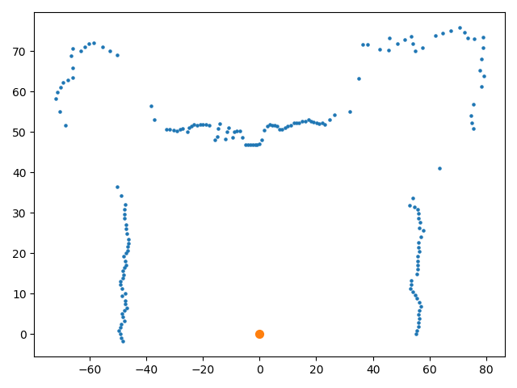
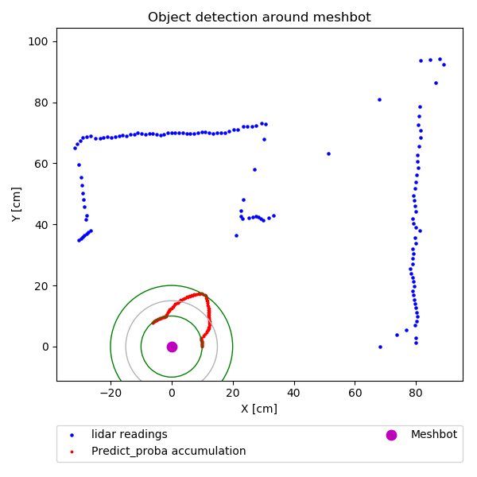

# Lidar AI

## [Project documentation](./doc/mainpage.md)
 
### Readme content:
1. [ About project ](#info)
2. [ Functionalities ](#fnc)

# About project

## Indoor object recognition from LIDAR using AI

  - Lidar readings preprocessing
  - Ploting
  - Neural Networks learning process
  - Evaluation

## Libraries

  - Numpy
  - Pandas
  - scikit-learn
  - SciPy
  - Tensorflow

## Our Team:

##### Developers
- Jakub Cebulski
- Miłosz Chlebowski
- Jakub Filipowicz
- Karol Michałek
- Paweł Olejnik
- Jakub Pawłowski

##### Tieto
- Szymon Wojciechowski
- Krystian Jankowski

##### Project supervisor
- Dr. Marek Bazan

# Functionalities

## Meshbot application

#### Code
<pre><code class="python">

</code></pre>

## Plot json file

The basic funcionality of our software is plotting lidar readings from jsons. All data are loading to memory and procesed as surrounding of meshbot. 

#### Code
sources/demo_application/plotting.py

<pre><code class="python">

from ploting.lidar_plot import plot_file

# preprocessing properties
max_to_interpolate = 5
g = 0.5

file = '../lidar_readings/s1.txt' # example

def main():
        plot_file(filename=file)
        plot_file(filename=file, gauss=g)
        plot_file(filename=file, interpolation=max_to_interpolate)
        plot_file(filename=file, gauss=g, interpolation=max_to_interpolate)

if __name__ == "__main__":
    main()
</code></pre>

### Parameters:
* file - path to json.txt file with lidar readings
* gauss - sigma scalar value of gaussian filter
* interpolation - number of points, which can by interpolate if they are missing

The drawing with gauss filter and interpolation looks as follows:

## Predict from json file

To predict where obstacle is located, you doesn't need live connected Meshbot, if you have saved json.txt file with readings. Lidar data are slicing into frames, by step of 5 points each. After that, neural network model scores them, and program calculate accumulation for  every angle point around Meshbot.  

#### Code
sources\demo_application\plot_pred.py
<pre><code class="python">

def main():
    files = test
    clf = load_model('..\models\mlpc_[500, 300, 200]_adam_300_0.01_100')
    for f in test:
        pred_and_plot(clf, clf_type='mlpc', input_f=f)

if __name__ == "__main__":
    main()

</code></pre>

### Parameters:
* input_f - path to json.txt file with lidar readings
* clf - loaded Neural Network Model
* clf_type - type of Neural Network:
  * mlpc
  * conv
  * rnn
  * dft
  
The example drawing of obstacle detection looks as follows:

