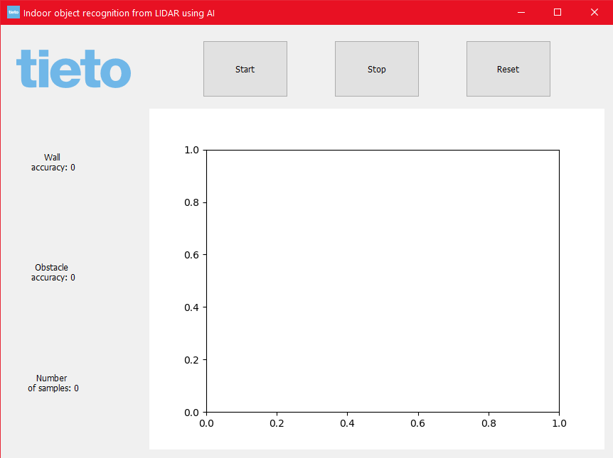

### [Main page](./mainpage.md)   

# Application
### Subsections

- [Application](#application)
    - [Subsections](#subsections)
  - [1. MQTT data](#1-mqtt-data)
  - [2. Data parsing](#2-data-parsing)
  - [3. Predicting obstacles](#3-predicting-obstacles)
  - [4. Plotting data](#4-plotting-data)
  - [5. Future GUI development](#5-future-GUI-development)

## 1. MQTT data

First thread receives data from meshbot using MQTT protocol and puts it in a queue

## 2. Data parsing

Second thread parses raw data and puts it as (x, y) coordinates in queue for plotting and as (yaw, lidar-reading) in queue for neural network. It also saves raw data as json file for later use.

## 3. Predicting obstacles

Main thread waits till it has 40 measurements available and calculates probability of object being an obstacle. Then result is put in list for plot and the oldest 5 measurments are discarded. Then it waits to have 40 measurments again.

## 4. Plotting data

Due to matplotlib limitations, animation plot needs to run in the main thread. It gets data from parser thread and neural network function via Queue objects.

**Blue dots** represent lidar distnace readings,

**green dot** represents robot location and

**red dots** represent probability of obstacle at given angle.

Three **circles** show probability thresholds, the innermost 0%, next one 50% and the last 100%.

## 5. Future 

For future use and demonstration of meshbot peformance there is a need for easy to use graphical user interface.
The interface should have basic functionalities such as:
- real-time plotting
- quality results of recognition
- starting robot
- stopping robot
- resetting robot

Example layout was made in pygt5.

###

###