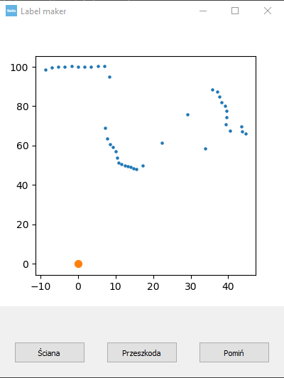

# Data
### Subsections

1. [Data mining](#min)
2. [Json file](#json)
3. [Surround loader](#surr)
4. [DataFrame](#df)
5. [Labeling](#lab)

### [Main page](./mainpage.md)   

## 1. Data mining

## 2. Json file
One frame od data from Meshbot looks like this:
<pre><code class="json">
{
	"state":"IDLE",
	"battery":91,
	"sonar":960,
	"distance":30,
	"sensors":[
	{
		"lidar":30,
		"ir":165,
		"yaw":60
	}, {
		"lidar":300,
		"ir":165,
		"yaw":0
	}, {
		"lidar":30,
		"ir":165,
		"yaw":0
	}, {
		"lidar":30,
		"ir":165,
		"yaw":0
	}, {
		"lidar":30,
		"ir":165,
		"yaw":0
	}, {
		"lidar":30,
		"ir":165,
		"yaw":0
	}, {
		"lidar":30,
		"ir":165,
		"yaw":0
	}, {
		"lidar":30,
		"ir":165,
		"yaw":0
	}, {
		"lidar":30,
		"ir":165,
		"yaw":0
	}, {
		"lidar":30,
		"ir":165,
		"yaw":0
	}]
}
 * 
</code></pre>

One frame contains 10 measured distances from lidar sensor with current angle of robot circle position.

## 3. Surround loader
the json file is read into memory, using class MeshbotData, the robot's environment is set for each angle. 

<pre><code class="python">

class MeshbotData:
    """holds lidar readings and reading angle in two lists"""

    def __init__(self, filename='log.txt'):
        self.yaw, self.lidar = separate_yaw_lidar_from_json(filename)
        self.mean()

</code></pre>
1. Loading file into memory
2. Separate yaw and lidar readings
3. Mean duplicated reading of each angle
4. Preprocess loaded data (optional) 
   * Interpolate
   * Gauss filter

## 4. DataFrame

Obstacle detection will be proceed by classificate frame of 40 angles frame. The whole surrounding is devided into frame of 40 angles with 5 angle step. 

### Columns: 
#### Lidar 0 - 39 (float):
Distance measured by lidar sensor
#### Label (int):
Presonal score of frame, 1-obstacle, 0-wall

## 5. Labeling
The procedure of labelling, had been used to collecting dataframe for  [machine learning models](./ml.md) and measure performance of predictions.

<pre><code class="python">
from preprocessing.dataset import datascore

datascore(file, prep=True)
</code></pre>

* file - filepath to json.txt file with lidar readings.
* prep - boll value if you can use preprocessing

One Json file is slicing into frames with width of 40 angles each. Every frame have to be score by user by press button:
Ściana (0), Przeszkoda (1), or just skip frame if it is hard to calssify.
#### 

### After score
If frames are scored, every frame is given into Pandas DataFrame objec and DataFrame is saved as .CSV file into memory with path /sources/input/jsonfile_name.csv . 

### Connecting files
To append data source for learning, use funcion:

<pre><code class="python">
from preprocessing.dataset import merge_to_maindata

merge_to_maindata(preprocessed=True)

</code></pre>

There mark preprocessed as True if you use preprocessing dataframes.