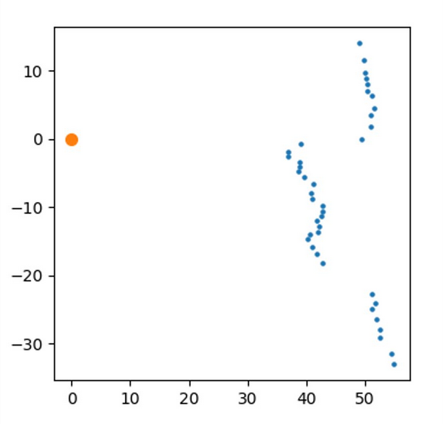
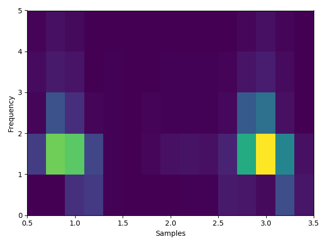

# DFT preprocessing module
### Subsections

1. [Raw data visualization](#Raw)
2. [Data preprocessing](#Prep)

### [Main page](./mainpage.md)   

## 1. Raw data visualization

Method is used for visualization raw data from .txt file. 
During project method was used for experimental selection of DFT prameters such as:
* samples in time window
* window kind
* number of overlap samples

In this case key factor of window size was number of neurons at first layer.
Size of the window can be calculated with following formula:

n_window = ((n_samples - (n_result-1)*n_overlap) - 1 +n_result^2)/n_result

where:

* n_window is a number of samples in time window
* n_samples is a number of input data samples
* n_result is a number of first layer neurons
* n_overlap is a number of samples which overlap between two neighboring windows

Transform settings are given as follows:

<pre><code class="python">
def __init__(self, window_samples=None, n_overlap=None, window_name=None, scaling=None):
    self.sett.append(window_samples)
    self.sett.append(window_name)
    self.sett.append(n_overlap)
    self.sett.append(scaling)
</code></pre>

To display data one needs to give filename:

<pre><code class="python">
def get_sectrogram_data(self, filename):
</code></pre>

## 2. Data preprocessing
Based on review of the literature concerning object recognition using neural networks, discrete fourier transform was chosen as one of the methods for preprocessing data.
Cause of which was that in some cases brought to fruition.
Method is operating on data collected in frames which were previously marked as wall or obstacle and saved in excel file.
Processed data are appended to vector. There is an option to display dft plots during calculations.

<pre><code class="python">
def dft_from_modules(self, csv_name, plot = False):
</code></pre>

* Raw data
###

###
* Processed data
###

###