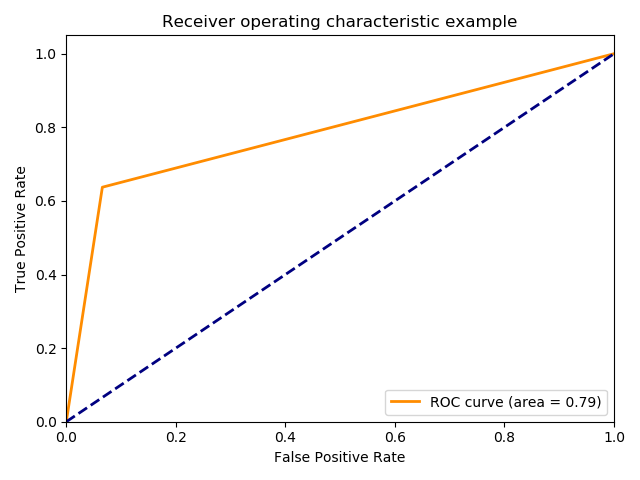
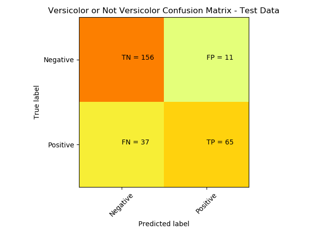
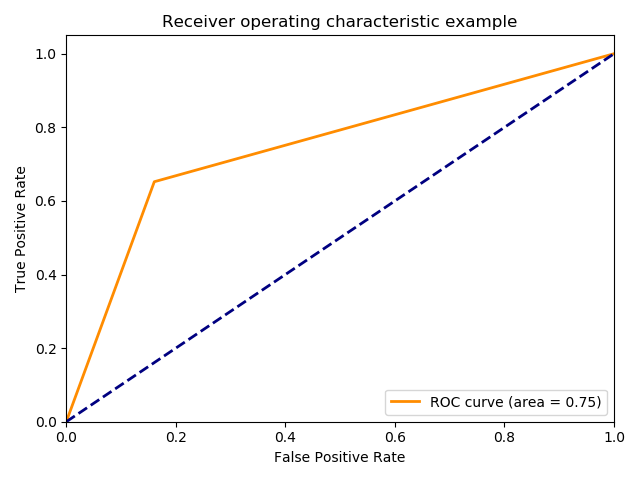
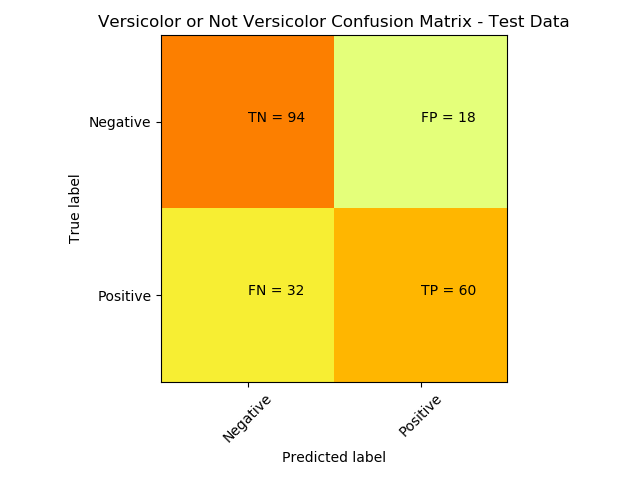

# Machine learning
### Subsections

1. [Input](#input)
2. [Frameworks and tools](#tools)
3. [Neural network models](#models)
### [Main page](./mainpage.md)   

## 1. Input

### Numpy array (40,)
dtype = float32

Where width of array represents numbers of angles from scored lidar reading frame.

## 2. Frameworks and tools
### Neural network 

The main framework used in project to machine larning is TensorFlow. Our implementations experienced with Dense , Convolutional and LSTM layers. Final MLPC model configuration presents the code below.
<pre><code class="python">
def teach_nn(x_data, y_data, layers, recursive=False, learning_rate=0.05, optimizer='sgd', epochs=100, activation='relu', batch=50):
    model = Sequential()

    look_back = 1
    size_nn = np.shape(x_data)[1]

    if recursive:
        x_data = np.reshape(x_data, (x_data.shape[0], 1, x_data.shape[1]))
        print(x_data.shape[0:])
        model.add(LSTM(units=layers[0], return_sequences = True, activation='tanh', input_shape=(look_back,size_nn)))
        for layer in layers[1:]:
            model.add(LSTM(units=layer, return_sequences = True, activation=activation))
            model.add(Dropout(0.2))
    else:
        model.add(Dense(units=layers[0], activation=activation, input_dim=size_nn))
        for layer in layers[1:]:
            model.add(Dense(units=layer, activation=activation))

    model.add(Dense(units=2, activation='softmax'))

    if optimizer == 'sgd':
        opt = optimizers.Adam(lr=learning_rate, beta_1=0.9, beta_2=0.999, epsilon=None, decay=0.0, amsgrad=False)
    if optimizer == 'adam':
        opt = optimizers.SGD(lr=learning_rate, clipnorm=1.)
    if recursive:
        model.compile(opt, loss='binary_crossentropy', metrics=['accuracy'])
    else:
        model.compile(opt, loss='categorical_crossentropy', metrics=['accuracy'])
    folds = StratifiedKFold(n_splits=10, shuffle=True, random_state=0).split(x_data, y_data)
    for fold in folds:
        X_train_cv = x_data[fold[0]]
        y_train_cv = y_data[fold[0]]
        X_valid_cv = x_data[fold[1]]
        y_valid_cv = y_data[fold[1]]
        if recursive:
            y_train_cv = np.reshape( y_train_cv, ( y_train_cv.shape[0], 1,  1))
            y_valid_cv = np.reshape(  y_valid_cv, (  y_valid_cv.shape[0], 1,  1))
        y_train_cv = np_utils.to_categorical(y_train_cv)
        y_valid_cv = np_utils.to_categorical(y_valid_cv)
        print(y_train_cv.shape[0:])
        model.fit(
            x=X_train_cv,
            y=y_train_cv,
            batch_size=batch,
            epochs=epochs,
            shuffle=True,
            verbose=True,
            validation_data=(X_valid_cv, y_valid_cv),
            )

    return model

</code></pre>

### Parameters
| Parameter | value             |
|---------------|---------------|
| learning_rate | 0.01          |
| optimizer     | adam          |
| layers        | 500, 300, 200 |
|               |               |

## 3. Neural network models 

### 3.1. Multi Layer Perceptron Classifier

### Roc chart

### Confusion matrix

### 3.2. Convolutional Neural Network

### Roc chart

### Confusion matrix
