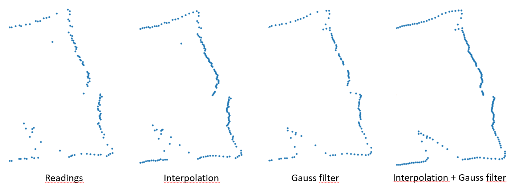

# Preprocessing
### Subsections

1. [Gauss filter](#Gauss)
2. [Interpolation](#interp)
3. [Comparison](#Comp)

### [Main page](./mainpage.md)   

## 1. Gauss filter

The method is used for filtration of measurements and rejection of incorrect, out-of-norms.

## 2. Interpolation 
Interpolation is expected to adding measurements in places where they are lacking. The maximum number of individual readings that can be added is 5. It is set in the function call

<pre><code class="python">
def interpolate(self, max_empty_space=5):

</code></pre>

## 3.  Comparison

#### 

###